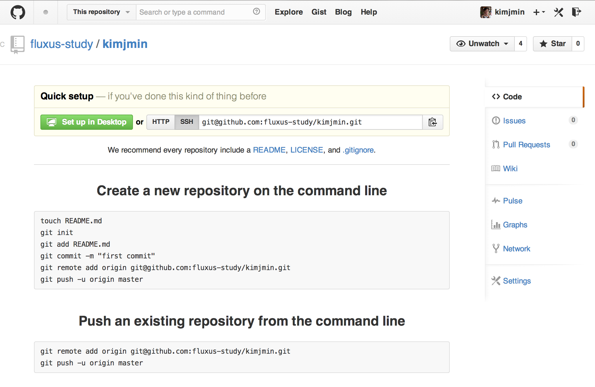
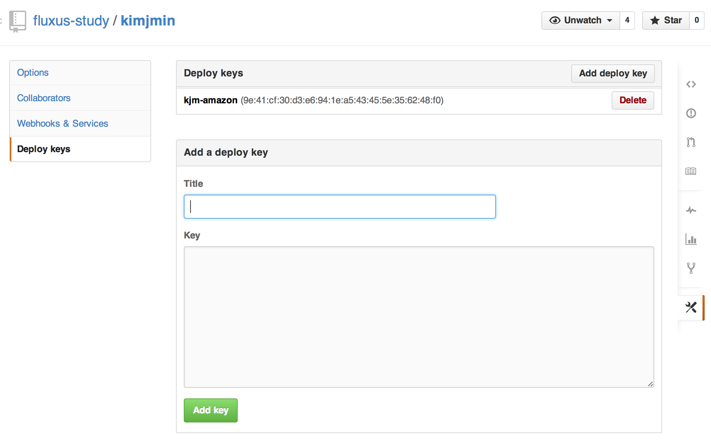

#MEAN Stack

##클라우드 서버 생성

- 서버 생성 : [아마존 웹 서버](https://console.aws.amazon.com/ec2/v2/home?region=ap-northeast-1)
  - 지역 : 도쿄
  - 서버 스펙 : { m1.small : { CPU : 1, Memory : 1.7BG } }
  - 서버 OS : Amazon Linux 64bit
  - 스토리지 : EBS 100GB
  - 비용 : $0.061 / 시간
- 접속 : ec2-user. root가 아니기 때문에 sudo 로 작업해야 함.

```
ssh -i ~/###.pem ec2-user@000.000.000.000
```
- yum 업데이트 :

```
sudo yum update -y
```
- git 설치

```
sudo yum install git
-> y
git help
```

##NodeJS 설치

- node 바이너리로 설치. 압축 풀고 경로 지정. ln 링크파일 만듦.

```
wget http://nodejs.org/dist/v0.10.28/node-v0.10.28-linux-x64.tar.gz
tar xvfz node-v0.10.28-linux-x64.tar.gz
sudo mv node-v0.10.28-linux-x64 /etc/node
sudo ln -s /etc/node/bin/node /usr/bin/node
sudo ln -s /etc/node/bin/npm /usr/bin/npm
ls -l /usr/bin/node
ls -l /usr/bin/npm
node
npm
```

- grunt, bower 설치

```
sudo npm install -g grunt-cli
sudo npm install -g bower
```

> 아마존 리눅스는 아마도 CentOS 기반인듯. yum 커맨드 등이 잘 실행됨.
> 기본으로 생성되는 ec2-user 계정으로 쭉 설치하고 실행.


##MongoDb 설치

- bash_profile 에 경로 추가.

```
wget https://fastdl.mongodb.org/linux/mongodb-linux-x86_64-2.6.1.tgz
tar xvfz mongodb-linux-x86_64-2.6.1.tgz
sudo mv mongodb-linux-x86_64-2.6.1 /etc/mongodb
ls -la /etc/mongodb/bin
vi .bash_profile
PATH=$PATH:/etc/mongodb/bin
source .bash_profile
sudo mkdir /data
sudo mkdir /data/db
sudo chown ec2-user:ec2-user /data/db
mongod
```

## MEAN 설치.

- 허광남님 동영상이랑 설치법 좀 다름. npm 인스톨로 바뀜. 편해짐. 짱.

```
sudo npm install -g meanio
mean -h
mean init kimjmin
cd kimjmin
npm install
grunt
```

- mean init 앱명 : 앱명으로 새로운 Mean 프로젝트 생성.
- npm install : package.json 안에 명시된 내용들을 설치함.

> 실행시켜보면 제대로 안됨. ㅡㅛㅡ; gcc가 제대로 없어서 그렇다 함.
> 염으로 gcc 설치하고 지금까지 설치한 모듈 클린하고 재설치. 필요.
> fluxus 프로젝트 디렉토리에서 아래 명령 실행. 다시 설치하고 그런트.

```
sudo yum install gcc gcc-c++
sudo npm install -g node-gyp
npm cache clean
rm -rf node_modules
npm install
```

- 실행중인 mean 멈추고 myPackage 생성.

```
mean package search
grunt
```

##회원가입

- 회원 가입 화면


- MongoDB 에서 데이터 확인.

```
mongo
db
show dbs
use mean-dev
db
show collections
db.users.find()
db.articles.find()
```

## Github 에 소스 등록.

- 깃헙 레파지토리 생성 : [https://github.com/fluxus-study/kimjmin](https://github.com/fluxus-study/kimjmin)



```
git init
git add .
git commit -m "종민 Mean 프로젝트 첫 등록"
git remote add origin git@github.com:fluxus-study/kimjmin.git
git remote -v
git push --set-upstream origin master
```

근데 하려고 하면 안됨... rsa 키 복사 해 줘야 함.

```
cd
ssh-keygen -t rsa
cd .ssh
ls
cat id_rsa.pub
```

이 내용을 깃헙에 등록해야 함.
- 깃헙 settings > Deploy keys > Add deploy key >



```
git push --set-upstream origin master
```

깃헙에 업로드 완료.
